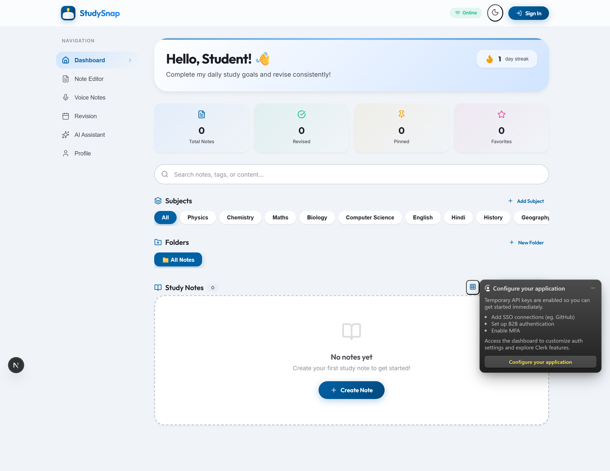
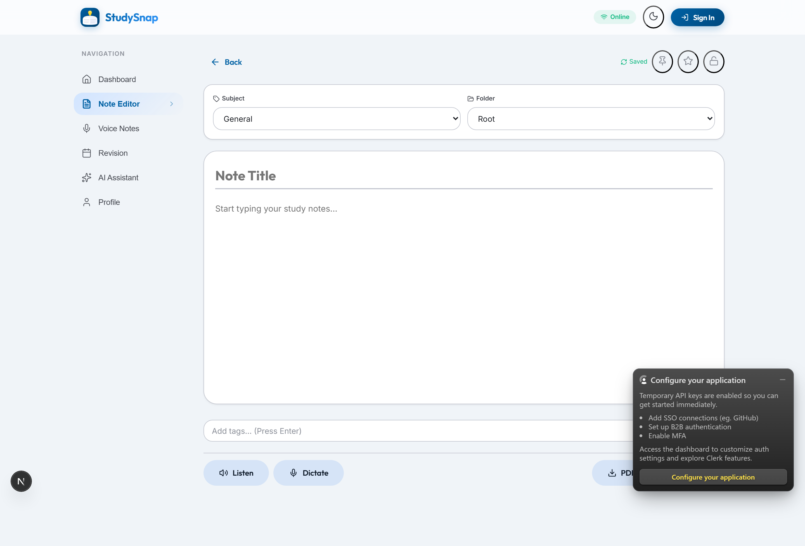
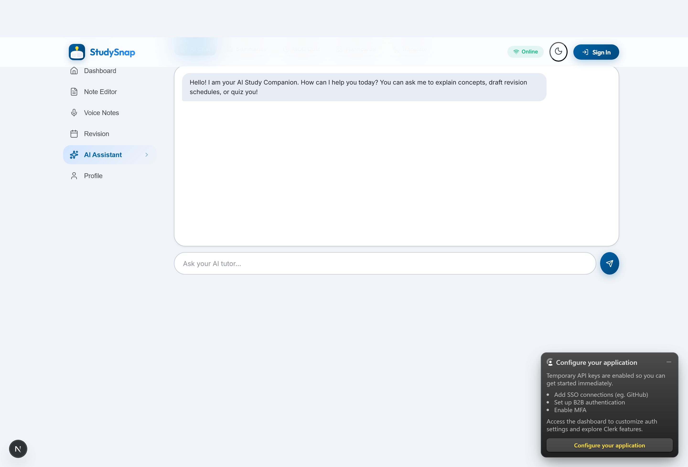
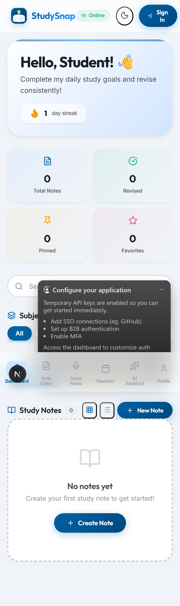

<div align="center">
  
  <h1>StudySnap — Frontend</h1>
  <p>Next.js 16 + React 19 progressive web app with premium Material Design 3 interface</p>
  <p>
    <a href="https://studysnap-sigma.vercel.app/" target="_blank">
      
    </a>
  </p>
</div>

## Screenshots

| Dashboard | Editor | AI Chat | Mobile |
|-----------|--------|---------|--------|
|  |  |  |  |

## Tech

| Category | Library |
|----------|---------|
| **Framework** | Next.js 16 + React 19 |
| **Language** | TypeScript |
| **State** | Zustand (persist) |
| **Auth** | Clerk |
| **AI** | Groq LLaMA-3.1 |
| **Design** | Material Design 3, Glassmorphism |
| **PWA** | Service Worker + Manifest |

## Key Components

| File | Purpose |
|------|---------|
| `app/page.tsx` | Main layout — glassmorphism header, sidebar, content, mobile nav |
| `app/globals.css` | Premium design system — MD3 tokens, animations, card system |
| `components/HomeScreen.tsx` | Dashboard — hero, streak, stats, search, subjects, folders, notes grid/list |
| `components/NoteEditor.tsx` | Full editor — auto-save, TTS/STT, PIN lock, PDF export, tags |
| `components/VoiceNotes.tsx` | Audio recording + playback + real-time transcription |
| `components/AiHelper.tsx` | AI chat, summarize, MCQ quiz, flashcards, Hindi/English translate |
| `components/RevisionCalendar.tsx` | Spaced repetition scheduler |
| `components/ProfileView.tsx` | Student profile with stats and Leaflet study zones map |
| `lib/store/useStore.ts` | Zustand store — 24 subjects, user, notes, revision system |

## Setup

```bash
cp .env.local.example .env.local
npm install
npm run dev
```

Open [http://localhost:3000](http://localhost:3000).

## Build

```bash
npm run build
npm start
```

## Live

🌐 [https://studysnap-sigma.vercel.app/](https://studysnap-sigma.vercel.app/)
