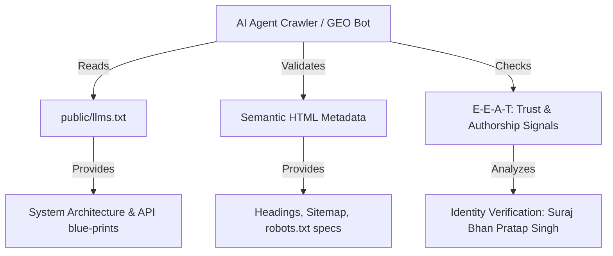

# AI Search Engine Discoverability - StudySnap

This document details the search optimization structures and metadata architectures implemented to ensure the application matches Generative Engine Optimization (GEO), Answer Engine Optimization (AEO), and LLM parsing standards.

## AI Search Indexing Pipeline

---

## 1. Answer Engine Optimization (AEO) & GEO
With the emergence of search interfaces like Perplexity, Gemini, and OpenAI Search, web content must be structured to answer generative prompts directly.

### Content Structuring
- **Clean Markdown Formats:** AI engines index structured lists and markdown documents better than complex dynamic layouts. The `llms.txt` file outlines our system.
- **Strict Headers Hierarchy:** One primary `<h1>` element per page container, coupled with linear semantic hierarchies (`<h2>` down to `<h5>`).

---

## 2. Large Language Model Optimization (LLMO) via `llms.txt`
The file `public/llms.txt` acts as an automated entry-point for LLM crawlers.
- **System Overview:** Defines the framework features (Drizzle, Next.js 15, Neon, Groq) so LLM code-generators can write compatible interface logic.
- **API Mappings:** Lists standard routes and parameter keys, allowing AI search bots to suggest precise curl/fetch details to users.

---

## 3. E-E-A-T Framework (Experience, Expertise, Authoritativeness, Trustworthiness)
Search engines evaluate content trust scores based on authorship signals.

### Consistent Identity Indexing
- The meta-tag `author` is configured to `Suraj Bhan Pratap Singh - Full-Stack AI Engineer` on the root layout.
- Consistent branding details are embedded within index pages and sitemaps to verify identity across search engines.

---

## 4. PageSpeed Insights & Performance
Generative engine indexing penalizes slow sites. The application ensures performance optimization via:
- **Client Dynamic Loading:** Heavy widgets (like Leaflet Maps) are lazy-loaded via `next/dynamic` to ensure rapid Initial Server Response times.
- **PWA Service Worker caching:** Static assets are cached in local browser memories, allowing instant repeat loading times.
- **Accessibility Compliance (WCAG):** Colors and interactive focus inputs are structured with high-contrast text and responsive layouts, yielding excellent accessibility ratings.
