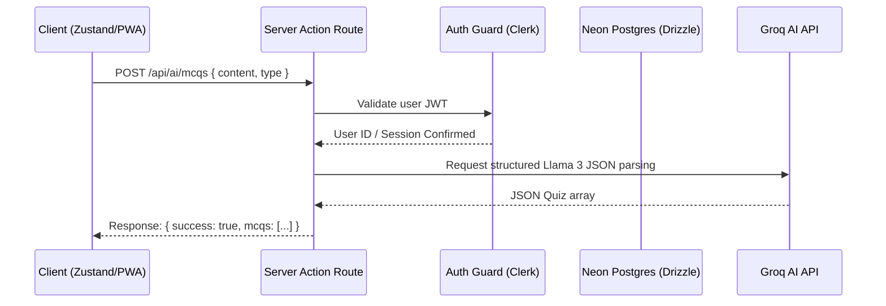

# Application API Specifications - StudySnap

This document defines the Next.js API endpoints constructed for database operations, folder management, and AI study tasks.

## Endpoint Flows



---

## 1. Study Notes Endpoints

### `GET /api/notes`
Fetches all active study notes for the authenticated student.
* **Headers:** `Authorization: Bearer <clerk_token>` (Optional fallback to mock)
* **Response (Success):**
  ```json
  {
    "success": true,
    "notes": [
      {
        "id": "uuid-string",
        "title": "Quantum Mechanics Intro",
        "content": "Content body...",
        "tags": "physics,math",
        "isPinned": false,
        "isFavorite": true,
        "categoryId": "category-uuid",
        "folderId": "folder-uuid",
        "nextRevisionAt": "2026-07-15T12:00:00Z"
      }
    ]
  }
  ```

### `POST /api/notes`
Upserts a single note. If `id` is provided and exists, updates the note. Otherwise, inserts a new note.
* **Payload:**
  ```json
  {
    "id": "uuid-optional",
    "title": "New Title",
    "content": "Rich text body...",
    "tags": ["chem", "valency"],
    "categoryId": "cat-uuid-or-null",
    "folderId": "folder-uuid-or-null",
    "isPinned": false,
    "isFavorite": false
  }
  ```
* **Response:** `{ "success": true, "note": { ... } }`

### `DELETE /api/notes?id=<note_id>`
Deletes a specific note.
* **Response:** `{ "success": true }`

---

## 2. Subject Categories Endpoints

### `GET /api/categories`
Lists presets and custom subject categories.
* **Response:** `{ "success": true, "categories": [...] }`

### `POST /api/categories`
Creates a subject category.
* **Payload:** `{ "name": "Biology", "color": "#EC4899" }`
* **Response:** `{ "success": true, "category": { ... } }`

---

## 3. Folders Endpoints

### `GET /api/folders`
Lists student directories/folders.
* **Response:** `{ "success": true, "folders": [...] }`

### `POST /api/folders`
Creates a directory folder.
* **Payload:** `{ "name": "Semester 1 Assignments" }`

---

## 4. Artificial Intelligence Endpoints

### `POST /api/ai/chat`
Sends messages log to Groq chat agent.
* **Payload:**
  ```json
  {
    "messages": [
      { "role": "user", "content": "Explain photosynthesis simply." }
    ]
  }
  ```
* **Response:**
  ```json
  {
    "success": true,
    "message": {
      "role": "assistant",
      "content": "Photosynthesis is the process plants use to convert sunlight into food..."
    }
  }
  ```

### `POST /api/ai/summarize`
Summarizes active note details.
* **Payload:** `{ "title": "Math Note", "content": "Formulas..." }`
* **Response:** `{ "success": true, "summary": "Concise summary markdown..." }`

### `POST /api/ai/mcqs`
Parses content to generate dynamic quizzes/flashcards.
* **Payload:** `{ "title": "History", "content": "Dates...", "type": "mcq" }`
* **Response:**
  ```json
  {
    "success": true,
    "mcqs": [
      {
        "question": "What happened in 1776?",
        "options": ["Declaration of Independence", "Industrial Revolution", "Magna Carta", "World War 1"],
        "answer": 0,
        "explanation": "The US Declaration of Independence was signed in 1776."
      }
    ]
  }
  ```
