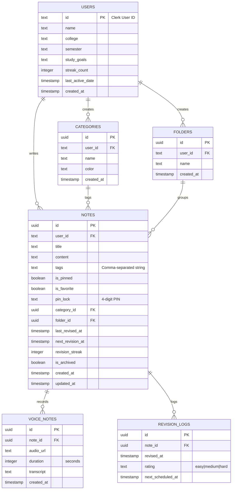

# Database Schemas & Relations - StudySnap

This document details the PostgreSQL database tables, field types, and foreign key constraints designed in Drizzle ORM for Neon PostgreSQL.

## Entity Relationship Diagram (ERD)

---

## 1. Table Definitions

### `users`
Tracks individual student goals, profiles, and streak records.
- `id` (text, primaryKey): Clerk User ID.
- `name` (text, notNull): Student full name.
- `college` / `semester` / `studyGoals` (text, nullable): Student meta details.
- `streakCount` (integer, default 0): Current consecutive active study days.
- `lastActiveDate` (timestamp, nullable): Date streak check was last run.

### `categories`
Groups notes under subjects (Physics, Chemistry, custom subjects).
- `id` (uuid, primaryKey): Unique ID.
- `userId` (text, notNull): Foreign Key linking categories to the creator user.
- `name` (text, notNull): Subject name (e.g. Maths).
- `color` (text, nullable): Subject hex accent code (e.g. `#0061A4`).

### `folders`
Organizes notes under hierarchical structures.
- `id` (uuid, primaryKey): Unique ID.
- `userId` (text, notNull): Creator user reference.
- `name` (text, notNull): Folder label (e.g. Semester 2).

### `notes`
Stores the rich-text note details, metadata, and spaced repetition tracking stats.
- `id` (uuid, primaryKey): Note identifier.
- `userId` (text, notNull): Author user reference.
- `title` (text, notNull): Note headline.
- `content` (text, notNull): Note body text.
- `tags` (text, nullable): Comma-separated tags lists (e.g. `optics,formula`).
- `isPinned` / `isFavorite` (boolean, default false): Dashboard priority states.
- `pinLock` (text, nullable): 4-digit PIN code to secure notes locally.
- `categoryId` (uuid, nullable): References `categories.id` (`set null` on delete).
- `folderId` (uuid, nullable): References `folders.id` (`cascade` on delete).
- `lastRevisedAt` / `nextRevisionAt` (timestamp, nullable): Scheduled revision dates.
- `revisionStreak` (integer, default 0): Spaced repetition streak levels.

### `voiceNotes`
Captures voice sessions associated with notes.
- `id` (uuid, primaryKey): Recording ID.
- `noteId` (uuid, notNull): References `notes.id` (`cascade` on delete).
- `audioUrl` (text, notNull): Web link or blob path to audio file.
- `duration` (integer, notNull): Recording length in seconds.
- `transcript` (text, nullable): Associated AI text transcripts.

### `revisionLogs`
Maintains records of spaced repetition events for performance stats.
- `id` (uuid, primaryKey): Log ID.
- `noteId` (uuid, notNull): References `notes.id` (`cascade` on delete).
- `revisedAt` (timestamp, default now): Review completion timestamp.
- `rating` (text): Difficulty assessment chosen by user (`easy`, `medium`, `hard`).
- `nextScheduledAt` (timestamp, notNull): Newly computed next review date.
