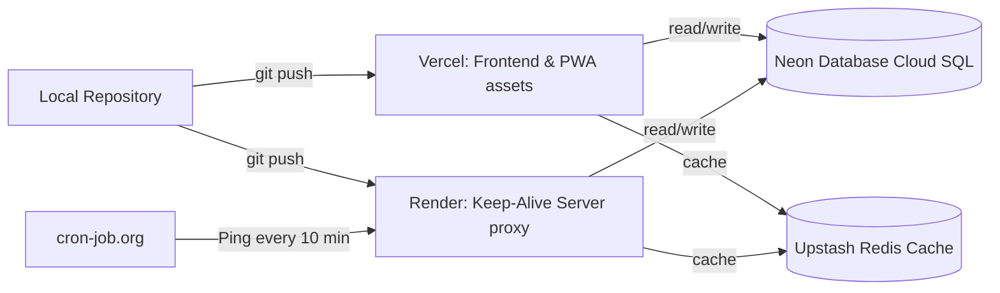

# Deployment & Hosting Guide - StudySnap

This document provides instructions for deploying the frontend to Vercel, API backend to Render, configuring database links to Neon Postgres, and maintaining server keep-alive endpoints using cron jobs.

## Deployment Pipelines



---

## 1. Environment Configurations
Configure the following environment variables across Vercel and Render dashboards:

| Variable | Scope | Description |
| --- | --- | --- |
| `DATABASE_URL` | Server | Connection URI to Neon Serverless PostgreSQL instance. |
| `GROQ_API_KEY` | Server | Groq API access token for Llama 3 summarizer and chatbots. |
| `NEXT_PUBLIC_CLERK_PUBLISHABLE_KEY` | Client/Server | Clerk Identity authentication token. |
| `CLERK_SECRET_KEY` | Server | Clerk private API credentials. |
| `UPSTASH_REDIS_REST_URL` | Server | Upstash Redis connection endpoint. |
| `UPSTASH_REDIS_REST_TOKEN` | Server | Upstash Redis authentication token. |

---

## 2. Database Hosting: Neon Postgres
1. Go to [Neon Console](https://neon.tech/) and create a new project.
2. Select your preferred region (e.g. US East) and choose **PostgreSQL 16**.
3. Under the dashboard connection details, copy the `Connection String` (pooled).
4. Run Drizzle migrations in your local workspace to push tables:
   ```bash
   npx drizzle-kit push
   ```

---

## 3. Frontend Hosting: Vercel
1. Sign up on [Vercel](https://vercel.com/) and click **Add New Project**.
2. Link your GitHub repository.
3. Under the **Framework Preset**, select **Next.js**.
4. Configure all environment variables listed in Section 1.
5. Click **Deploy**. Vercel will build the Next.js App Router and deploy PWA static files.

---

## 4. Backend & Keep-Alive Hosting: Render & Cron-job
Since Render's free tier services spin down after 15 minutes of inactivity, we configure a keep-alive route and set up `cron-job.org` to keep the server constantly active.

1. Create a Web Service on [Render](https://render.com/).
2. Link your Next.js project. Set the build command to `npm run build` and start command to `npm run start`.
3. Set the variables `DATABASE_URL` and `GROQ_API_KEY` on Render.
4. Once deployed, note down your Render service URL (e.g. `https://study-notes-backend.onrender.com`).
5. Go to [cron-job.org](https://cron-job.org/).
6. Click **Create Cronjob**.
7. Name the cronjob `StudyNotes-KeepAlive`.
8. Paste your Render endpoint URL (e.g. `https://study-notes-backend.onrender.com/api/notes`).
9. Set the interval execution timer to **Every 10 minutes**.
10. Click **Save**.
