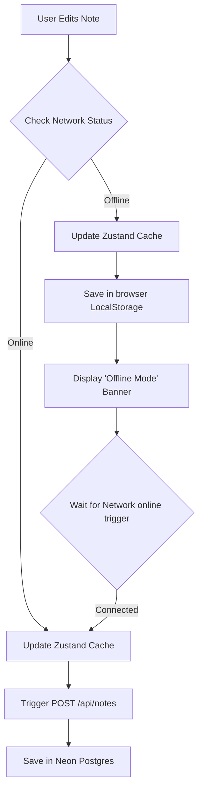

# Error Handling & Edge Cases - StudySnap

This document outlines the failure modes, error boundaries, browser API exceptions, and synchronization edge cases handled in the **StudySnap** application.

## Offline State Data Flow

---

## 1. Network Failure & Offline Operation
- **Situation:** The student is inside a basement library or on an airplane, and loses internet access mid-study.
- **Handling:**
  - The application detects connectivity changes via a listener on the window `online` and `offline` events.
  - The header immediately switches from **"Online"** to **"Offline Mode"** in a red badge.
  - CRUD operations on notes, categories, and folders are committed locally to the Zustand persistent store and serialized to the browser's local storage.
  - Next.js API requests are deferred and optimistically skipped while offline. Once connectivity is restored, the application triggers a batch reconciliation update to synchronize local notes with the Neon database.

---

## 2. Mic Permission Lockout (STT & Voice Notes)
- **Situation:** The user clicks the Voice Note recorder or Note Editor dictation button but has browser microphone access blocked.
- **Handling:**
  - Standard JavaScript try-catch blocks wrap `navigator.mediaDevices.getUserMedia`.
  - If permissions are rejected, the app displays a clear system alert warning the user to check their device settings, preventing browser crashes.
  - Buttons immediately reset their states to inactive (`isRecording: false`, `isListening: false`).

---

## 3. Web Speech Synthesis Limitations (TTS)
- **Situation:** Note content contains complex HTML code elements, emojis, or foreign scripts that break standard SpeechSynthesis audio playback.
- **Handling:**
  - The Text-to-Speech parser processes note contents through regex filters to strip out HTML tags (`/<[^>]*>/g`) before passing the string to the speech engine.
  - If the speech synthesis engine is interrupted or fails to load a selected voice model, the `onerror` callbacks catch the crash, clear the `isSpeaking` states, and restore standard button UI states.

---

## 4. Locked Note Security Concealment
- **Situation:** A student locks a private note with a 4-digit PIN, but its content is still readable in summary feeds.
- **Handling:**
  - When rendering notes list previews or card details on the dashboard, the notes renderer checks if `pinLock` is not null.
  - If a PIN is active, the content rendering is overridden to display a masked placeholder text: `"[Encrypted / Password Protected Notes]"`, completely hiding note data until the user inputs the matching PIN.

---

## 5. Blank Title / Content Saves
- **Situation:** A student opens the Note Editor and immediately returns back, creating empty notes.
- **Handling:**
  - The editor automatically detects blank titles, defaulting them to `"Untitled Note"`.
  - The auto-save handler ignores empty drafts where both title and content are blank, keeping the database clear of orphan nodes.
