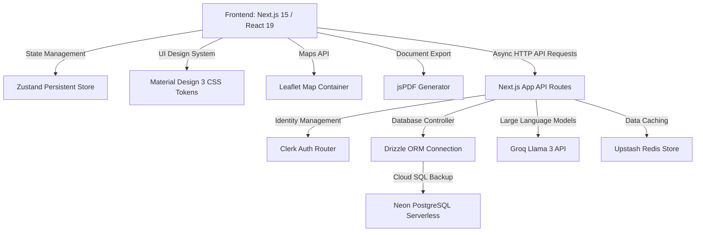

# Technology Stack - StudySnap

This document details the software architecture, libraries, APIs, and frameworks selected for the **StudySnap** web application.

## Core Technologies

---

### 1. Framework & Core UI
- **Framework:** Next.js 15 (using App Router, TypeScript `@types/node` and `@types/react` integration)
- **Library:** React 19
- **Design System:** Material Design 3 (standardized via root-level custom CSS variables in `globals.css`)
- **Icons:** `lucide-react` library

### 2. State & Caching (Offline Compatibility)
- **Global State Store:** Zustand (with persistent middleware targeting browser `localStorage` for offline support)
- **Local Database Sync:** HTML5 Web Storage API
- **Cloud Caching:** Upstash Redis (`@upstash/redis` wrapper)

### 3. Database Layer
- **DB Hosting:** Neon PostgreSQL (Serverless instance)
- **ORM Schema Client:** Drizzle ORM (`drizzle-orm` + `drizzle-kit` command utilities)
- **Database Driver:** `@neondatabase/serverless`

### 4. Integration APIs & Services
- **Authentication:** Clerk Identity (`@clerk/nextjs` auth routing)
- **AI Core:** Groq API SDK (`groq-sdk` targeting Llama-3-8b models)
- **Maps Engine:** Leaflet (with dynamic React wrapper `react-leaflet`)
- **PDF Core:** `jspdf` (Client-side vector document rendering)
- **Notifications & Streaks:** Canvas-Confetti effects (`canvas-confetti`)
