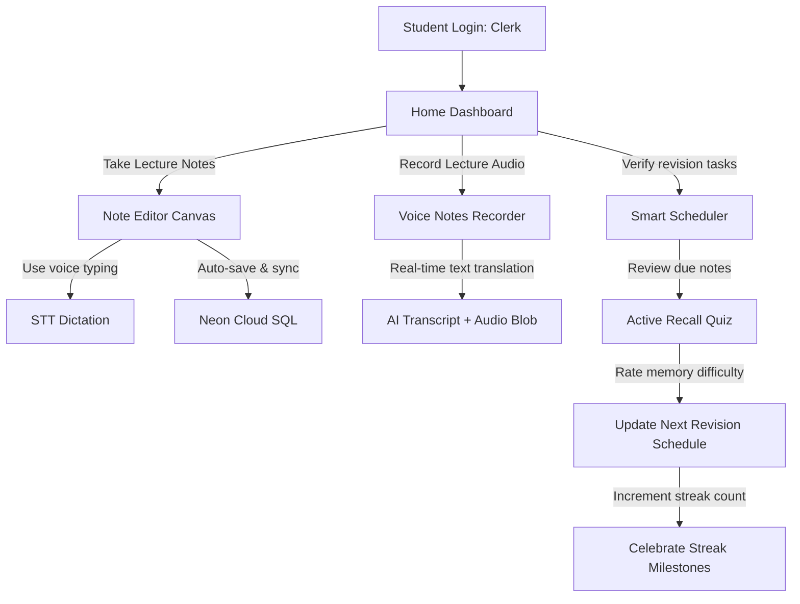

# Study Workflow Guides - StudySnap

This document outlines the step-by-step student interaction patterns, starting from user authentication to taking rich-text notes, reviewing audio logs, and executing spaced revisions.

## Student Lifecycle Journey

---

## 1. Onboarding & Registration
1. The student opens the web application and is welcomed by a landing app-bar.
2. Clicking **Login** triggers the Clerk overlay, offering Google Login, Email/Password sign-ins, and reset options.
3. Upon successful validation, the dashboard renders the student's name, college, and current study metrics.

---

## 2. Dynamic Note Capture Workflow
1. The student clicks **Create Note** to launch the editor.
2. They input a title and begin typing notes.
3. If they prefer to speak during lectures:
   - They click the **Dictate** microphone button.
   - The browser prompts for microphone permissions.
   - The speech engine transcribes spoken words directly into the editor body at the cursor position.
4. If they want to verify how a note sounds:
   - They click the **Listen Note** speaker button.
   - The Text-to-Speech system reads note paragraphs aloud.
5. The editor auto-saves content changes in the background every 1.5 seconds.
6. The student adds relevant keywords in the **Tags** field and links the note to a specific **Subject Category** (e.g., Physics) or **Study Folder** (e.g., Semester 1).

---

## 3. Study Revisions & Spaced repetition
1. On the **Home Dashboard**, the app highlights notes that are due for revision based on spacing curves.
2. The student goes to the **Revision Mode** tab.
3. They select a due note and review its content.
4. Once finished, they rate their memory level:
   - **Hard:** Next review scheduled in 1 day.
   - **Medium:** Next review scheduled in 3 days.
   - **Easy:** Next review scheduled in 7 days.
5. The study streak count increments, triggering a colorful canvas-confetti celebration to boost student motivation.
