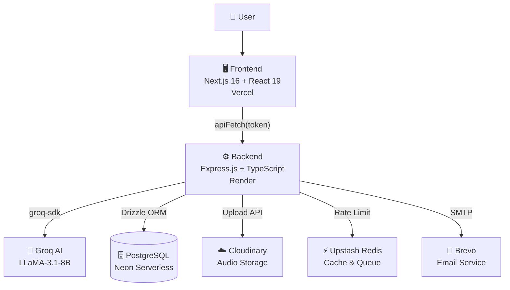

<p align="center">
  <picture>
    <source media="(prefers-color-scheme: dark)" srcset="FRONTEND/public/studysnap-logo.svg">
    
  </picture>
</p>

<h1 align="center">StudySnap</h1>

<p align="center">
  <strong>Your Intelligent Study Companion</strong><br>
  Create · Organize · Revise · Conquer
</p>

<p align="center">
  <a href="https://studysnap-sigma.vercel.app/" target="_blank">
    
  </a>
  <a href="https://github.com/surajrajput999/StudySnap" target="_blank">
    
  </a>
</p>

<p align="center">
  
  
  
  
  
</p>

<p align="center">
  
  
  
  
  
  
  
  
  
  
</p>

---

## ✨ Demo

<p align="center">
  
</p>

---

## 📸 Screenshot Gallery

<p align="center">
  
  
</p>

<p align="center">
  
  
  
</p>

---

## 🚀 Features

<table align="center">
  <tr>
    <td align="center" width="100"><b>🤖 AI</b></td>
    <td>Groq LLaMA-3.1 chat · One-click summarization · MCQ quiz generator · Flip flashcards · Hindi ↔ English translation</td>
  </tr>
  <tr>
    <td align="center"><b>📝 Notes</b></td>
    <td>Rich text editing · Auto-save · PIN lock security · PDF export · TXT/MD import · Hashtag system · Grid/list view</td>
  </tr>
  <tr>
    <td align="center"><b>🎙️ Voice</b></td>
    <td>Record with pause/resume · Variable playback (0.5×–2×) · Real-time speech-to-text transcription · Link to notes</td>
  </tr>
  <tr>
    <td align="center"><b>📅 Revision</b></td>
    <td>Spaced repetition algorithm · Easy/Medium/Hard ratings · Visual calendar · Streak tracking · Revision history logs</td>
  </tr>
  <tr>
    <td align="center"><b>📄 PDF</b></td>
    <td>AI PDF assistant · Analyze and summarize documents · Extract key information · Export notes to PDF</td>
  </tr>
  <tr>
    <td align="center"><b>🔒 Security</b></td>
    <td>Clerk OAuth · JWT session verification · PIN-locked notes · CSRF protection · Rate limiting · Helmet headers</td>
  </tr>
  <tr>
    <td align="center"><b>📱 PWA</b></td>
    <td>Installable on home screen · Service worker caching · Offline access · Manifest.json · Native app feel</td>
  </tr>
</table>

---

## 🏗️ Architecture



---

## 📦 Tech Stack

<p align="center">
  
  
  
  
  
  
  
  
  
  
  
  
  
  
  
</p>

---

## 📁 Folder Structure

```
studysnap/
├── FRONTEND/                            # Next.js 16 + React 19
│   ├── app/
│   │   ├── page.tsx                     # Main SPA layout
│   │   ├── layout.tsx                   # Root layout + Clerk provider
│   │   └── globals.css                  # MD3 design system
│   ├── components/
│   │   ├── HomeScreen.tsx               # Dashboard with hero, stats, notes
│   │   ├── NoteEditor.tsx               # Rich text editor with auto-save
│   │   ├── VoiceNotes.tsx              # Audio recorder + transcription
│   │   ├── AiTutor.tsx                 # AI chat with streaming
│   │   ├── AiHelper.tsx                # Summarize, MCQs, flashcards
│   │   ├── RevisionCalendar.tsx        # Spaced repetition scheduler
│   │   ├── GamificationHub.tsx         # Achievements, XP, leaderboard
│   │   ├── ProfileView.tsx             # Student profile + study zones
│   │   ├── MobileDrawer.tsx            # MD3 navigation drawer
│   │   ├── HeroAI.tsx                  # AI landing hero section
│   │   └── EmptyState.tsx              # Empty state illustrations
│   ├── lib/
│   │   ├── store/useStore.ts            # Zustand persisted store
│   │   └── config.ts                   # API config + apiFetch helper
│   ├── public/
│   │   ├── window.svg                  # App icon
│   │   ├── studysnap-logo.svg          # Full logo
│   │   └── manifest.json              # PWA manifest
│   └── docs/
│
├── BACKEND/                             # Express.js + TypeScript
│   └── src/
│       ├── index.ts                    # Server entry + middleware
│       ├── routes/                     # REST API endpoints
│       │   ├── ai.ts                   # /api/ai/* — Groq integration
│       │   ├── notes.ts                # /api/notes/* — CRUD
│       │   ├── voiceNotes.ts           # /api/voice-notes/*
│       │   ├── revision.ts            # /api/revision/*
│       │   └── webhooks.ts            # External webhooks
│       ├── services/                   # Business logic
│       │   ├── ai.ts                   # Groq chat, summarize, MCQ, translate
│       │   ├── email.ts               # Brevo transactional emails
│       │   └── storage.ts             # Cloudinary uploads
│       ├── middleware/
│       │   ├── auth.ts                # Clerk JWT verification
│       │   ├── security.ts            # CORS, Helmet, CSRF
│       │   └── rateLimiter.ts         # 20 req/min AI limit
│       ├── db/                         # Drizzle ORM schema + migrations
│       ├── config/env.ts              # Environment config
│       └── types/                      # TypeScript interfaces
│
├── .env.example                        # Environment template
└── package.json                        # Root scripts
```

---

## ⚡ Quick Start

### Prerequisites

- **Node.js** ≥ 20.x
- **npm** ≥ 10.x
- [Clerk](https://clerk.com) account for authentication
- [Groq](https://groq.com) API key for AI features
- [Neon](https://neon.tech) PostgreSQL database (optional — mock mode available)

### Setup

```bash
# 1. Clone the repository
git clone https://github.com/surajrajput999/StudySnap.git
cd StudySnap

# 2. Install all dependencies
npm run install:all

# 3. Configure environment variables
cp .env.example BACKEND/.env
cp FRONTEND/.env.local.example FRONTEND/.env.local

# 4. Start development servers
npm run dev
```

### Access

| Service | URL |
|---------|-----|
| **Frontend** | `http://localhost:3000` |
| **Backend** | `http://localhost:4000` |
| **Health Check** | `http://localhost:4000/api/health` |

---

## 🔐 Environment Variables

### Backend (`BACKEND/.env`)

```env
# Required
GROQ_API_KEY=gsk_xxx                  # Groq AI API key
CLERK_SECRET_KEY=sk_test_xxx          # Clerk secret key
FRONTEND_URL=http://localhost:3000     # CORS origin (use Vercel URL in prod)
NODE_ENV=development                  # Set "production" on Render

# Database
DATABASE_URL=postgresql://...         # Neon PostgreSQL connection

# Optional
CLOUDINARY_CLOUD_NAME=xxx
CLOUDINARY_API_KEY=xxx
CLOUDINARY_API_SECRET=xxx
UPSTASH_REDIS_URL=https://xxx.upstash.io
UPSTASH_REDIS_TOKEN=xxx
BREVO_API_KEY=xxx
BREVO_SENDER_EMAIL=study@notes.ai
```

### Frontend (`FRONTEND/.env.local`)

```env
NEXT_PUBLIC_CLERK_PUBLISHABLE_KEY=pk_test_xxx
CLERK_SECRET_KEY=sk_test_xxx
NEXT_PUBLIC_BACKEND_URL=http://localhost:4000  # Render URL in production
```

---

## 🌍 Deployment

### Frontend → Vercel

[](https://vercel.com/new)

1. Connect your GitHub repository
2. Set framework to **Next.js**
3. Add environment variables:
   - `NEXT_PUBLIC_CLERK_PUBLISHABLE_KEY`
   - `CLERK_SECRET_KEY`
   - `NEXT_PUBLIC_BACKEND_URL` → your Render backend URL
4. Deploy

### Backend → Render

1. Create a new **Web Service** from your repository
2. Set **Root Directory** to `BACKEND`
3. Set **Build Command** to `npm install && npm run build`
4. Set **Start Command** to `npm start`
5. Add environment variables:
   - `NODE_ENV=production`
   - `GROQ_API_KEY`, `CLERK_SECRET_KEY`, `FRONTEND_URL`, `DATABASE_URL`
6. Deploy

---

## ⚡ Performance

<table align="center">
  <tr>
    <td align="center">📱 <b>Responsive</b></td>
    <td>Mobile · Tablet · Desktop — three distinct layouts via CSS Grid</td>
  </tr>
  <tr>
    <td align="center">📦 <b>PWA</b></td>
    <td>Installable · Service worker · Offline caching · Manifest.json</td>
  </tr>
  <tr>
    <td align="center">🎨 <b>MD3</b></td>
    <td>Material Design 3 tokens · Glassmorphism · Elevation system · Dark mode</td>
  </tr>
  <tr>
    <td align="center">⚡ <b>Lazy Loading</b></td>
    <td>Code splitting · Dynamic imports · Framer Motion staggered animations</td>
  </tr>
  <tr>
    <td align="center">🛡️ <b>Security</b></td>
    <td>Clerk auth · Helmet · CORS · CSRF · Rate limiting (20 req/min AI)</td>
  </tr>
</table>

---

## 🗺️ Roadmap

<table align="center">
  <tr>
    <th>Version</th>
    <th>Features</th>
    <th>Status</th>
  </tr>
  <tr>
    <td><b>v1.0</b></td>
    <td>AI Assistant · Note Editor · Voice Notes · Revision Calendar · Gamification · PWA · Dark Mode</td>
    <td>✅ <b>Released</b></td>
  </tr>
  <tr>
    <td><b>v1.1</b></td>
    <td>Offline mode · Analytics dashboard · Collaborative notes · AI mind maps · Flashcards import/export</td>
    <td>🔄 <b>In Progress</b></td>
  </tr>
  <tr>
    <td><b>v2.0</b></td>
    <td>Mobile native apps (iOS/Android) · Real-time collaboration · Study groups · AI-generated practice tests · API marketplace</td>
    <td>📋 <b>Planned</b></td>
  </tr>
</table>

---

## 🤝 Contributing

Contributions make the open-source community an amazing place to learn and grow. Any contributions are **greatly appreciated**.

1. **Fork** the repository
2. **Create** a feature branch (`git checkout -b feature/amazing-feature`)
3. **Commit** your changes (`git commit -m 'Add amazing feature'`)
4. **Push** to the branch (`git push origin feature/amazing-feature`)
5. **Open** a Pull Request

> Please ensure your code follows existing style conventions and passes lint checks.

---

## 📄 License

Distributed under the **MIT License**. See `LICENSE` for more information.

---

## 👤 Author

<p align="center">
  <strong>Suraj Bhan Pratap Singh</strong><br>
  Full-Stack AI Engineer
</p>

<p align="center">
  <a href="https://github.com/surajrajput999">
    
  </a>
  <a href="https://www.linkedin.com/in/suraj-bhan-pratap-singh-891727293/">
    
  </a>
  <a href="https://surajbhan-15.vercel.app/">
    
  </a>
</p>

---

<p align="center">
  <br><br>
  <strong>Built with ❤️ for students by Suraj</strong><br><br>
  <a href="https://github.com/surajrajput999/StudySnap/issues">Report Bug</a>
  ·
  <a href="https://github.com/surajrajput999/StudySnap/issues">Request Feature</a>
  ·
  <a href="https://studysnap-sigma.vercel.app/">Live Demo</a>
  <br><br>
  
  
  
  
</p>
