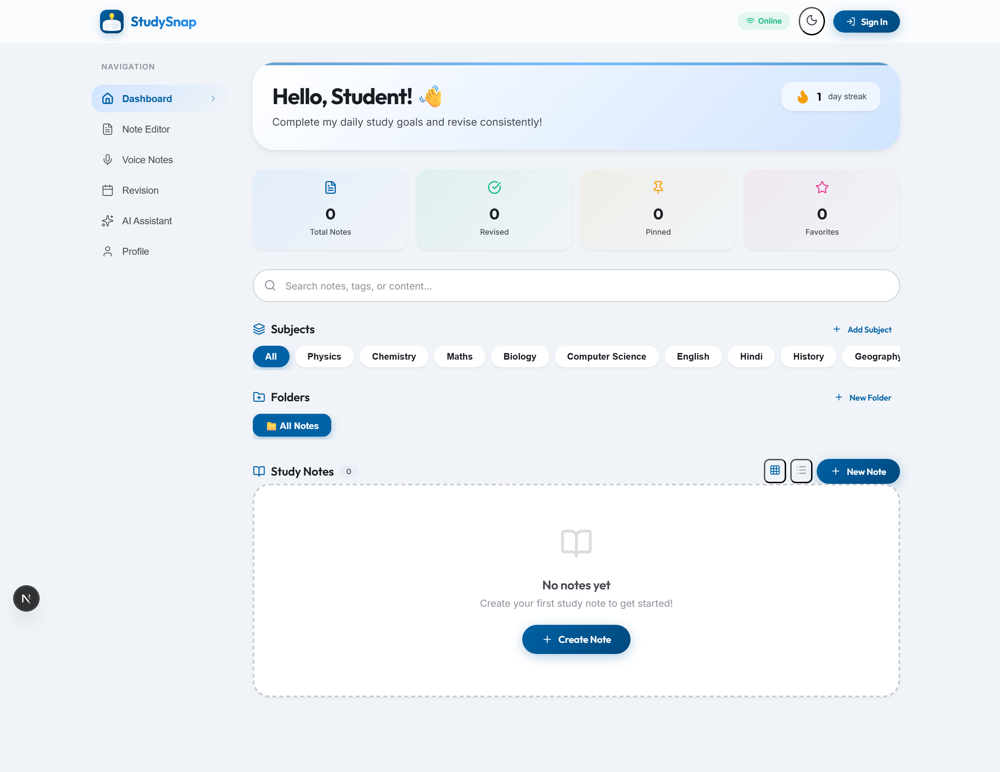
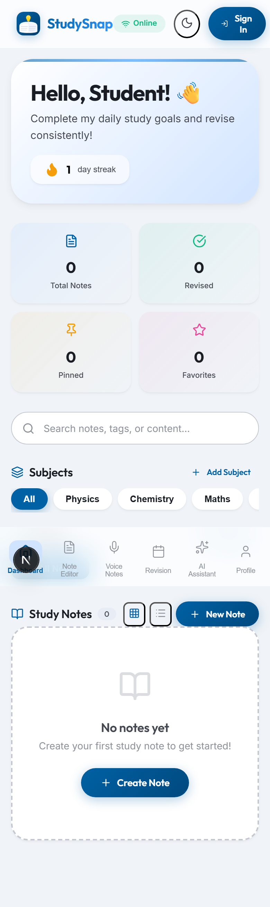
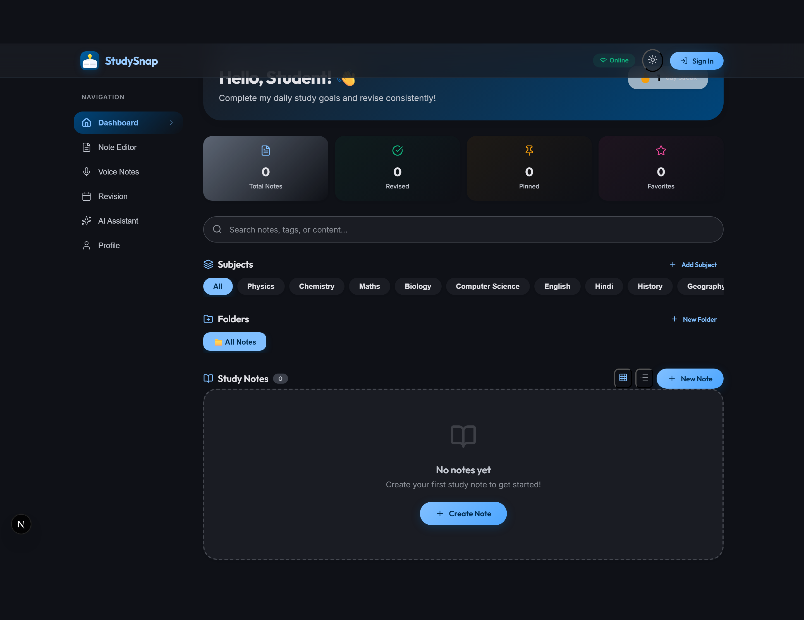
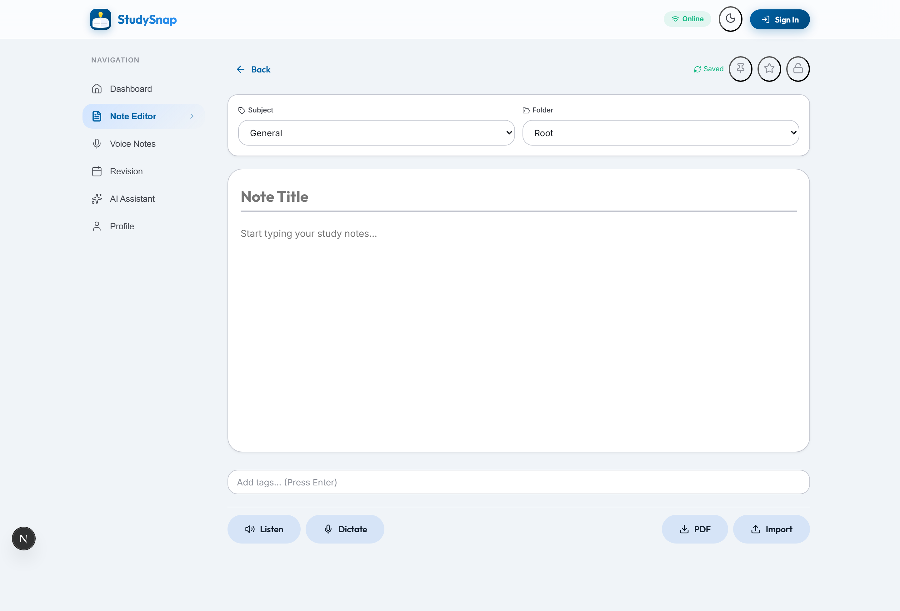
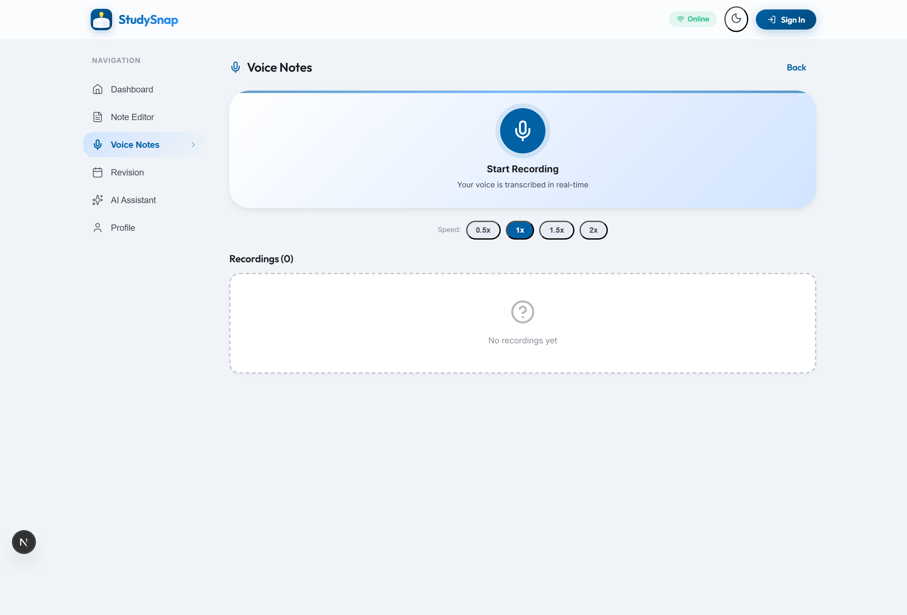
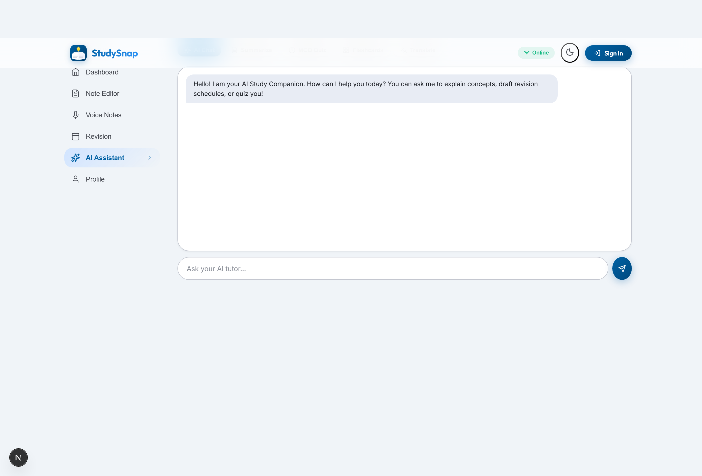
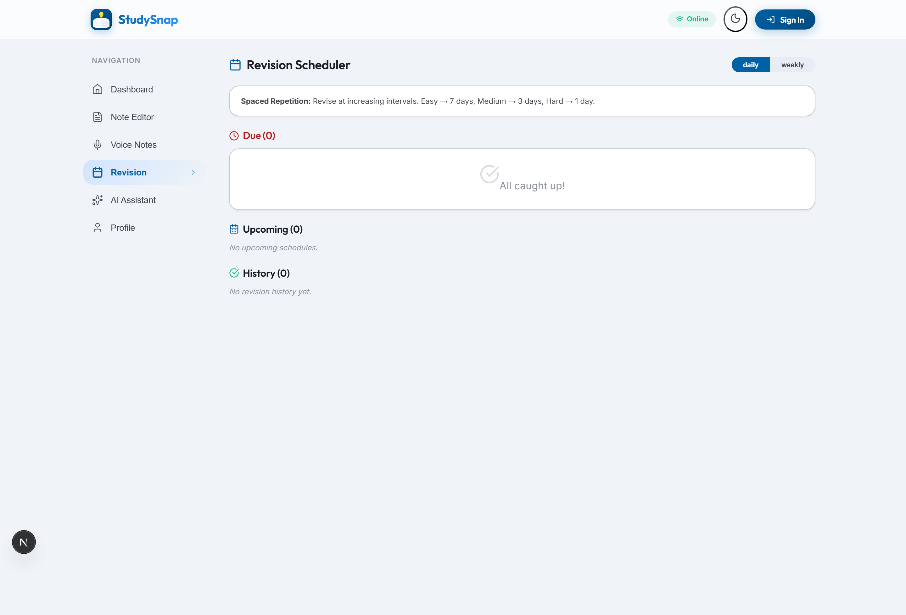
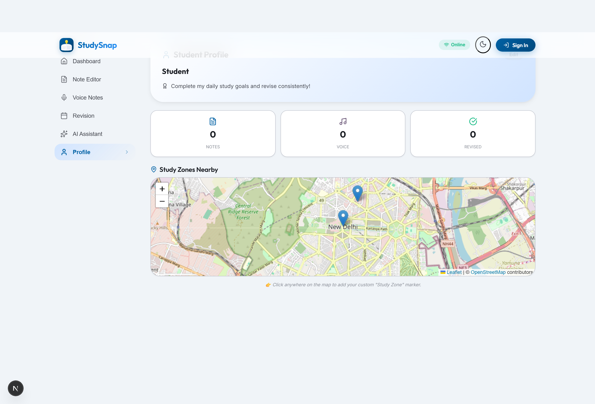

<div align="center">
  <picture>
    <source media="(prefers-color-scheme: dark)" srcset="FRONTEND/public/studysnap-logo.svg">
    
  </picture>
  <h1 style="font-size: 2.8em; margin: 8px 0 0; letter-spacing: -1px; background: linear-gradient(135deg, #0061A4, #10B981); -webkit-background-clip: text; -webkit-text-fill-color: transparent; background-clip: text;">
    StudySnap
  </h1>
  <p style="font-size: 1.15em; color: #666; margin-bottom: 20px;">
    <strong>Your Intelligent Study Companion</strong><br>
    Create · Organize · Listen · Revise · Conquer
  </p>
  <p>
    <a href="https://studysnap-sigma.vercel.app/" target="_blank">
      
    </a>
  </p>
  <p>
    
    
    
    
    
    
    
    
    
    
    
  </p>
</div>

<br>

---

## 📋 Table of Contents

- [✨ Features](#-features)
- [🎥 Screenshots](#-screenshots)
- [🏗️ Architecture](#️-architecture)
- [⚡ Quick Start](#-quick-start)
- [🔧 Tech Stack](#-tech-stack)
- [📖 API Overview](#-api-overview)
- [🧪 Commands](#-commands)
- [🌍 Deployment](#-deployment)
- [🤝 Contributing](#-contributing)

---

## ✨ Features

<div align="center">

| | Feature | Description |
|---|---------|-------------|
| 🎯 | **Elite Dashboard** | Personalized greeting, streak tracking, stats bar, 24 pre-loaded subjects, custom folders, full-text search, pin/favorite system, grid/list view toggle — all with staggered animations |
| 📝 | **Advanced Note Editor** | Rich text editing with auto-save, text-to-speech (listen aloud), speech-to-text (voice dictation), hashtag system, PIN lock security, PDF export, TXT/MD import |
| 🎙️ | **Voice Notes** | Record audio notes with pause/resume, variable playback speed (0.5×–2×), real-time speech-to-text transcription, link recordings to existing notes |
| 🤖 | **AI Assistant** | Chat with Groq LLaMA-3.1, one-click note summarization, interactive MCQ quiz generator with explanations, flip flashcards, Hindi ↔ English translation — all with confetti celebrations! |
| 📅 | **Smart Revision** | Spaced repetition algorithm with Easy/Medium/Hard ratings, visual revision calendar, daily reminders, streak tracking, revision history logs |
| 👤 | **Student Profile** | Customizable profile — name, school/college, field of study, class/semester, study goals, interactive Leaflet study zones map, stats dashboard |
| 🎨 | **Premium UI** | Material Design 3 design system, glassmorphism effects, gradient cards, smooth staggered animations, seamless dark/light mode toggle, responsive mobile-first layout |
| 📱 | **PWA Offline** | Full progressive web app — service worker caching, installable on mobile/desktop home screen, works offline with cached notes, manifest.json support |

</div>

---

## 🎥 Screenshots

<div align="center">

### Dashboard

| Desktop | Mobile | Dark Mode |
|---------|--------|-----------|
|  |  |  |

### Feature Modules

| Note Editor | Voice Notes | AI Assistant |
|-------------|-------------|--------------|
|  |  |  |

| Revision Calendar | Profile & Stats |
|-------------------|-----------------|
|  |  |

</div>

---

## 🏗️ Architecture

```
studysnap/
├── FRONTEND/                          # Next.js 16 + React 19 + TypeScript
│   ├── app/
│   │   ├── page.tsx                   # Main layout — glassmorphism header, sidebar, content, mobile nav
│   │   └── globals.css                # Premium MD3 design tokens, glassmorphism, animations, card system
│   ├── components/
│   │   ├── HomeScreen.tsx             # Dashboard — hero, stats, search, 24 subjects, folders, notes grid/list
│   │   ├── NoteEditor.tsx             # Full editor — auto-save, TTS/STT, PIN lock, PDF export, tags
│   │   ├── VoiceNotes.tsx            # Audio recording — pause/resume, playback speed, real-time transcription
│   │   ├── AiHelper.tsx              # AI companion — chat, summarizer, MCQ quiz, flashcards, translator
│   │   ├── RevisionCalendar.tsx      # Spaced repetition scheduler with visual calendar
│   │   └── ProfileView.tsx           # Student profile — stats, edit form, Leaflet study zones map
│   ├── lib/
│   │   ├── store/useStore.ts         # Zustand store — 24 default subjects, user, notes, voice notes, revision
│   │   └── config.ts                 # API config + apiFetch helper with Clerk auth token
│   ├── public/
│   │   ├── window.svg                # App logo (lightbulb + open book)
│   │   ├── studysnap-logo.svg        # 400×400 full logo
│   │   ├── manifest.json             # PWA manifest
│   │   └── sw.js                     # Service worker for offline caching
│   └── docs/                         # Architecture, API, deployment, tech stack docs
│
├── BACKEND/                           # Express.js + TypeScript API
│   └── src/
│       ├── routes/                    # RESTful endpoints — notes, voice-notes, ai, revision, webhooks
│       ├── services/                  # Business logic — Groq AI chat/summarize/MCQ/translate, email, payments
│       ├── middleware/                # Clerk auth, rate limiting (20 req/min AI), Helmet security, CORS, CSRF
│       ├── db/                        # Drizzle ORM schema + migrations + Neon PostgreSQL connection
│       └── config/env.ts             # Zod-validated environment config
│
├── package.json                       # Root scripts — dev, build, lint, install:all
└── .env.example                       # Environment variable template
```

### Data Flow

```
Client (Next.js)
  │
  ├── Clerk Auth ──► Session Token
  │
  └── apiFetch(token) ──► Express Backend (port 4000)
          │
          ├── authMiddleware ──► JWT verification
          ├── rateLimiter ────► 20 req/min per IP
          │
          ├── /api/notes ──────► Neon PostgreSQL + Drizzle ORM
          ├── /api/voice-notes ► Cloudinary audio storage
          ├── /api/ai ─────────► Groq LLaMA-3.1 API
          └── /api/revision ───► Spaced repetition logic
```

---

## ⚡ Quick Start

### Prerequisites

- **Node.js** ≥ 20.x
- **npm** ≥ 10.x
- A [Clerk](https://clerk.com) account (for authentication)
- A [Groq](https://groq.com) API key (for AI features)
- A [Neon](https://neon.tech) PostgreSQL database (optional — mock mode available)

### Setup

```bash
# 1. Clone the repository
git clone https://github.com/surajrajput999/StudySnap.git
cd StudySnap

# 2. Install all dependencies (frontend + backend)
npm run install:all

# 3. Configure environment variables
cp .env.example BACKEND/.env
cp FRONTEND/.env.local.example FRONTEND/.env.local

# 4. Start both servers in development mode
npm run dev
```

### Environment Variables

| Variable | Required | Description |
|----------|----------|-------------|
| `NEXT_PUBLIC_CLERK_PUBLISHABLE_KEY` | ✅ | Clerk publishable key (frontend) |
| `CLERK_SECRET_KEY` | ✅ | Clerk secret key (both) |
| `NEXT_PUBLIC_BACKEND_URL` | ✅ | Backend URL (default: `http://localhost:4000`) |
| `GROQ_API_KEY` | ✅ | Groq API key for AI features |
| `DATABASE_URL` | ❌ | Neon PostgreSQL connection string |
| `CLOUDINARY_*` | ❌ | Cloudinary media storage config |
| `BREVO_API_KEY` | ❌ | Brevo transactional email API key |
| `UPSTASH_REDIS_*` | ❌ | Redis cache config |

> **Note:** The app works in **mock mode** without `GROQ_API_KEY` — AI features return sample data.

### Access

| Service | URL |
|---------|-----|
| **Frontend** | http://localhost:3000 |
| **Backend** | http://localhost:4000 |
| **Health Check** | http://localhost:4000/api/health |

---

## 🔧 Tech Stack

| Category | Technology | Purpose |
|----------|-----------|---------|
| **Frontend Framework** | Next.js 16 + React 19 | SSR, App Router, server/client components |
| **Language** | TypeScript | End-to-end type safety |
| **State Management** | Zustand (persist middleware) | localStorage-persisted global store |
| **Backend** | Express.js + TypeScript | RESTful API server |
| **Database** | Neon PostgreSQL + Drizzle ORM | Serverless SQL with type-safe queries |
| **Authentication** | Clerk | OAuth, magic links, session management |
| **AI / LLM** | Groq (LLaMA-3.1-8B) | Chat, summarization, MCQ generation, flashcards, translation |
| **Cache** | Upstash Redis | Rate limiting, session cache |
| **Media Storage** | Cloudinary | Voice note audio hosting |
| **Email** | Brevo (Sendinblue) | Transactional emails |
| **Queue** | BullMQ (Redis-backed) | Background job processing |
| **Security** | Helmet, CORS, Rate Limiting | HTTP headers, cross-origin, brute-force protection |
| **Maps** | Leaflet + OpenStreetMap | Study zone location display |
| **PWA** | Web Manifest + Service Worker | Offline support, installable app |
| **Payments** | Razorpay | Order creation, payment verification |
| **Design System** | Material Design 3 | Glassmorphism, elevation, custom properties, animations |

---

## 📖 API Overview

| Method | Endpoint | Description | Auth |
|--------|----------|-------------|------|
| `GET` | `/api/health` | Server health & service status | No |
| `GET` | `/api/notes` | List all notes | Yes |
| `POST` | `/api/notes` | Create a new note | Yes |
| `GET` | `/api/notes/:id` | Get note by ID | Yes |
| `PATCH` | `/api/notes/:id` | Update note | Yes |
| `DELETE` | `/api/notes/:id` | Delete note | Yes |
| `GET` | `/api/notes/categories` | List categories | Yes |
| `POST` | `/api/ai/chat` | AI chat completion | Yes |
| `POST` | `/api/ai/summarize` | Summarize note content | Yes |
| `POST` | `/api/ai/mcqs` | Generate MCQs or flashcards | Yes |
| `POST` | `/api/ai/translate` | Translate note content | Yes |
| `POST` | `/api/voice-notes` | Upload voice note | Yes |
| `GET` | `/api/voice-notes` | List voice notes | Yes |
| `POST` | `/api/revision/mark` | Mark note as revised | Yes |
| `GET` | `/api/revision/logs` | Get revision history | Yes |
| `POST` | `/api/payments/create-order` | Create Razorpay order | Yes |
| `POST` | `/api/payments/verify` | Verify payment | Yes |

---

## 🧪 Commands

| Command | Description |
|---------|-------------|
| `npm run dev` | Start frontend (port 3000) + backend (port 4000) concurrently |
| `npm run build` | Build both frontend + backend for production |
| `npm run start` | Start production servers |
| `npm run lint` | Lint frontend code |
| `npm run install:all` | Install deps for root + FRONTEND + BACKEND |

---

## 🌍 Deployment

### Frontend (Vercel)

The frontend is deployed at:
<p>
  <a href="https://studysnap-sigma.vercel.app/" target="_blank">
    
  </a>
</p>

Environment variables required on Vercel:
- `NEXT_PUBLIC_CLERK_PUBLISHABLE_KEY`
- `CLERK_SECRET_KEY`
- `NEXT_PUBLIC_BACKEND_URL` (set to your deployed backend URL)

### Backend (Any Node.js host)

Deploy `BACKEND/` to Railway, Render, Fly.io, or any Node.js host.

Required environment variables:
- `PORT`, `NODE_ENV`
- `CLERK_SECRET_KEY`
- `GROQ_API_KEY`
- `DATABASE_URL` (Neon PostgreSQL)
- `FRONTEND_URL` (your deployed frontend URL, for CORS)
- `CLOUDINARY_*`, `BREVO_API_KEY`, `UPSTASH_REDIS_*` (optional)

---

## 🤝 Contributing

Contributions are welcome! Here's how you can help:

1. **Fork** the repository
2. **Create** a feature branch (`git checkout -b feature/amazing-feature`)
3. **Commit** your changes (`git commit -m 'Add amazing feature'`)
4. **Push** to the branch (`git push origin feature/amazing-feature`)
5. **Open** a Pull Request

Please ensure your code follows the existing style conventions and passes lint checks.

---

<div align="center">
  <br>
  
  <br><br>
  <p>
    Built with ❤️ by
    <a href="https://github.com/surajrajput999"><strong>Suraj Bhan Pratap Singh</strong></a>
  </p>
  <p>
    <a href="https://github.com/surajrajput999/StudySnap/issues">Report Bug</a>
    ·
    <a href="https://github.com/surajrajput999/StudySnap/issues">Request Feature</a>
    ·
    <a href="https://studysnap-sigma.vercel.app/">Live Demo</a>
  </p>
  <p>
    
    
    
  </p>
</div>
